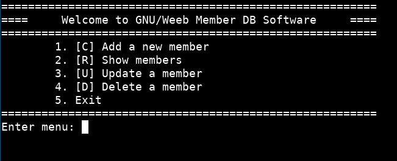

# Simple CRUD GNU/Weeb Membership
This is a simple CRUD (Create, Read, Update, Delete) program written in Assembly
x86-64, specifically for Linux with System V AMD64 ABI calling convention.



# Data Structure
In this program, we use the following struct layout to store the record.
```c
struct member {
	char	name[64];		// Name
	char	tg_username[32];	// Telegram username
	char	gender;			// m (male), f (female), h (hidden)
};
```

# Contribute
We welcome pull request on the GitHub repository
https://github.com/GNUWeeb/simple-crud-gw-membership

Visit our Telegram group <a href="https://t.me/GNUWeeb">@GNUWeeb</a>

# License
This software is licensed under the GNU GPL-2.0
